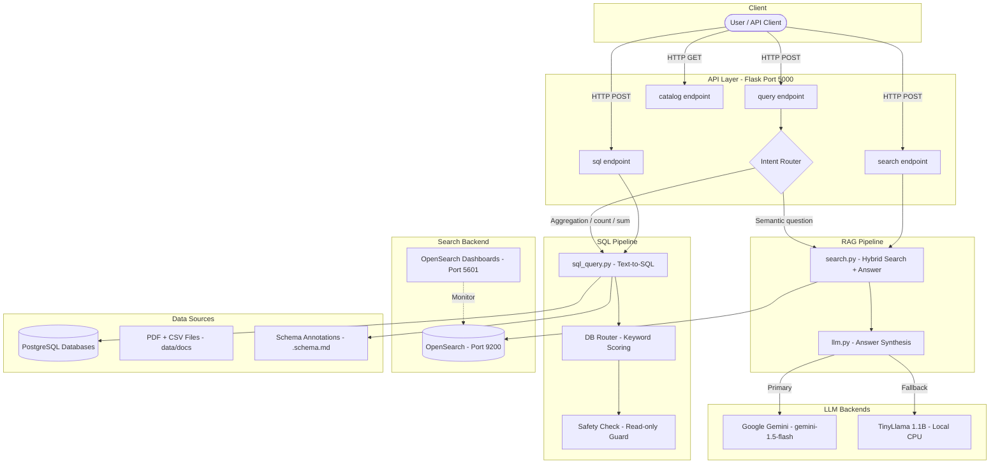
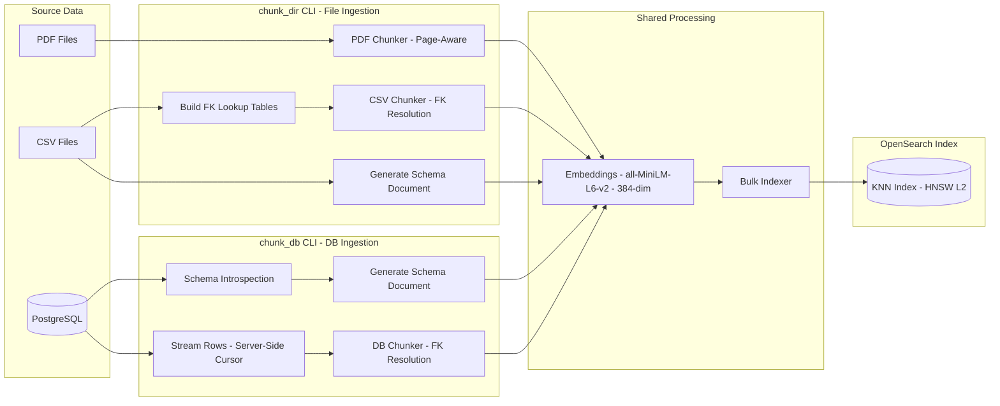
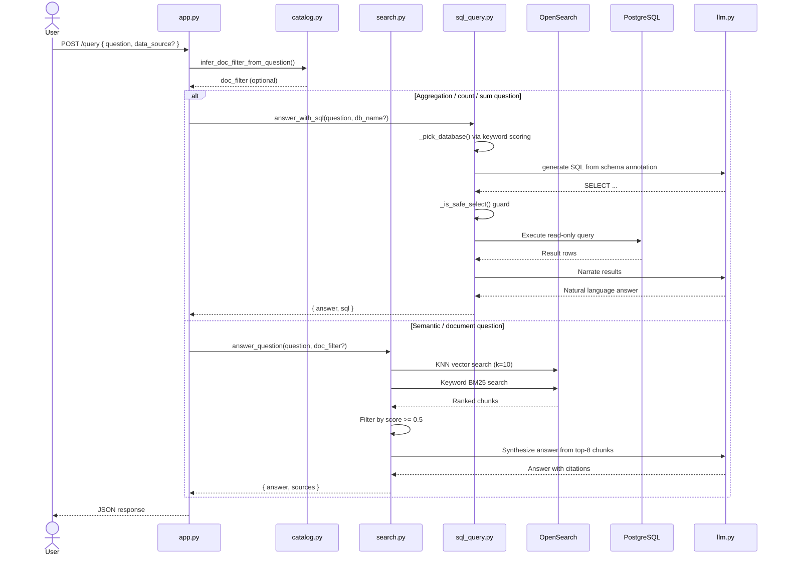
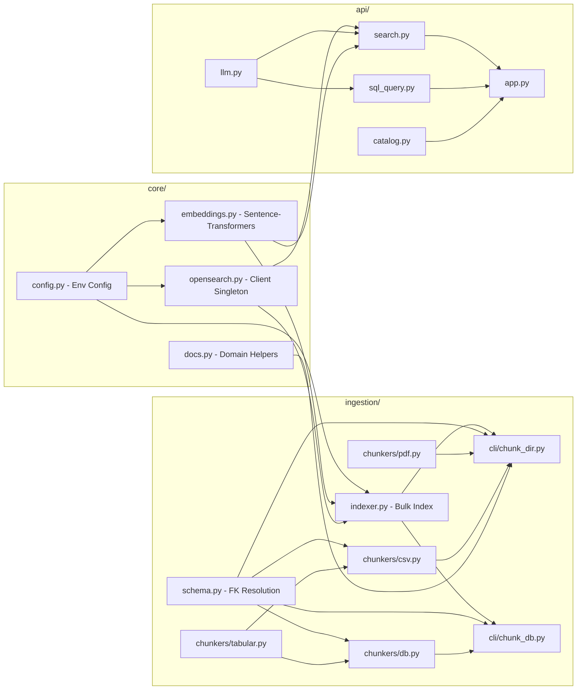
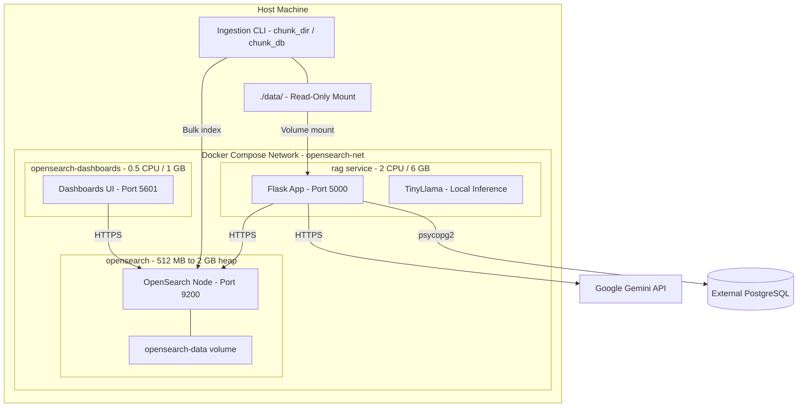

# Wall-E — System Architecture

## Overview

Wall-E is a **Hybrid RAG (Retrieval-Augmented Generation)** system that answers natural-language questions about laboratory data by combining semantic vector search, keyword search, and LLM-generated SQL over multiple data sources.

---

## High-Level Architecture

---

## Ingestion Pipeline

---

## Query Pipeline

---

## Component Map

---

## Docker Infrastructure

---

## Data Model (OpenSearch Document)

Each indexed chunk stored in OpenSearch contains:

| Field | Type | Description |
|---|---|---|
| `text` | keyword + text | Raw chunk content |
| `content_vector` | knn_vector (384-dim) | Sentence embedding |
| `doc_name` | keyword | Source document name |
| `doc_type` | keyword | `Service Manual`, `User Manual`, `Document` |
| `source_type` | keyword | `pdf`, `csv`, `db` |
| `table_name` | keyword | CSV/DB table name |
| `start_page` / `end_page` | integer | PDF page range |
| `start_row` / `end_row` | integer | CSV/DB row range |
| `db_name` | keyword | Source database name |

---

## Key Design Decisions

| Decision | Choice | Reason |
|---|---|---|
| Vector index | OpenSearch HNSW (L2) | Combines KNN + keyword in one store |
| Embedding model | `all-MiniLM-L6-v2` (384-dim) | Lightweight, CPU-friendly |
| Primary LLM | Google Gemini 1.5 Flash | Quality + speed |
| Fallback LLM | TinyLlama 1.1B | Offline / no-API-key operation |
| SQL safety | Forbidden-keyword blocklist + read-only transactions | Prevent data mutation |
| Chunking | 300–500 tokens, 50-token overlap | Balances context and precision |
| SQL routing | Regex pattern matching on question | Fast, no LLM needed to route |
| FK resolution | Inline expansion at chunk time | Improves recall and LLM comprehension |
